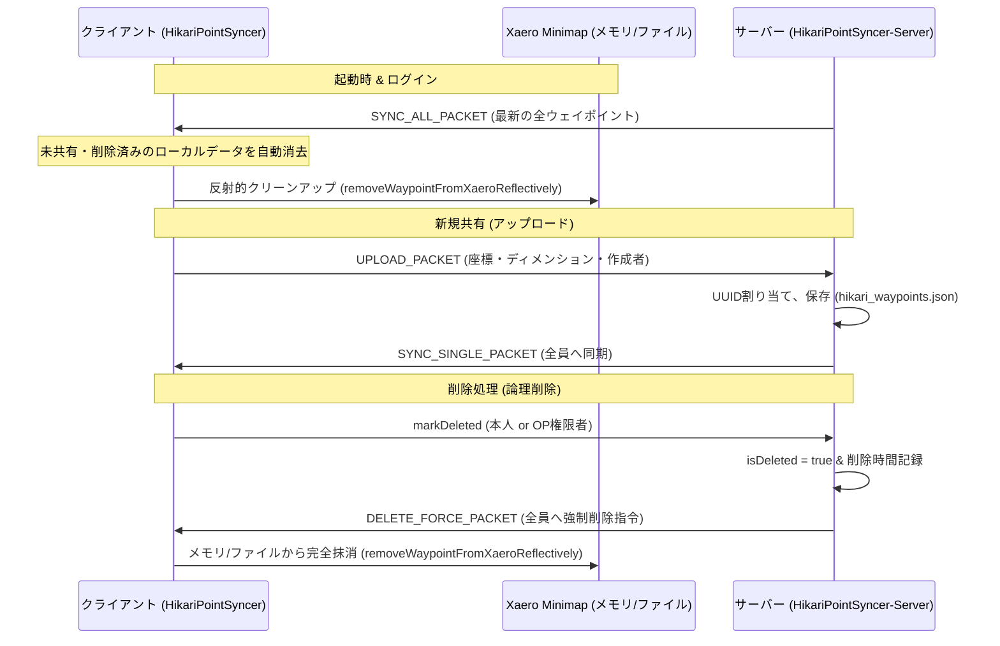

# HikariPointSyncer 技術仕様書 (TECHREADME)

本書は、マインクラフト（Fabric 1.18.2）のウェイポイント同期Modである **HikariPointSyncer** の内部構造、パケット通信仕様、メモリ反射（Reflection）操作、および自動アップデート/クリーンアップアルゴリズムについて詳細に解説する開発者・管理者向け技術資料です。

---

## 🗺️ 全体アーキテクチャ

HikariPointSyncer は、サーバーサイドで一元管理されるウェイポイントデータベースと、各クライアント側のミニマップMod（主に **Xaero's Minimap & World Map**）との間を仲介し、リアルタイムでの同期、強制削除、および自動アップデートを提供するハイブリッド設計を採用しています。

---

## 📂 主要モジュールとソースコード解説

### 1. エントリーポイント

*   [HikariPointSyncer.java](/HikariPointSyncer/src/main/java/net/atsukigames/hikaripointsyncer/HikariPointSyncer.java)
    *   **役割**: Mod共通のエントリーポイント。
    *   **詳細**: Mod ID、ネットワークパケットの識別子（Identifier）の定義、およびクライアントからアップロード要求を受け取る `UPLOAD_PACKET` レシーバーの登録を行います。

*   [HikariPointSyncerClient.java](/HikariPointSyncer/src/main/java/net/atsukigames/hikaripointsyncer/client/HikariPointSyncerClient.java)
    *   **役割**: クライアントサイドのエントリーポイント。
    *   **詳細**: 
        *   GUIを開くためのホットキー（デフォルト: `Right Control`）のキーバインディング登録。
        *   サーバーから受信する各種同期パケット（`SYNC_ALL_PACKET`, `SYNC_SINGLE_PACKET`, `DELETE_FORCE_PACKET`）のレシーバー登録。
        *   `SYNC_ALL_PACKET` 受信時に、サーバーから既に削除されている過去のダウンロード済みウェイポイントを自動でローカルから抹消するクリーンアップアルゴリズムの制御。

---

### 2. ネットワーク同期 & データ管理

*   [SyncWaypoint.java](/HikariPointSyncer/src/main/java/net/atsukigames/hikaripointsyncer/data/SyncWaypoint.java)
    *   **役割**: ウェイポイントのデータモデルおよびパケットシリアライザ。
    *   **構造**:
        *   `UUID id`: サーバーが割り当てる絶対的な一意識別キー。
        *   `String name`: ウェイポイント名（Xaero等に表示される名前、サフィックスなし）。
        *   `String author`: 作成者のプレイヤーUUID（文字列形式）。
        *   `int x, y, z`: 座標。
        *   `String dimension`: `overworld`, `the_nether`, `the_end` などのディメンションキー。
        *   `String authorName`: 作成者のユーザーネーム（GUI上での表示用）。
        *   `long deletedTime`: 削除された時間（Unixエポックミリ秒）。
        *   `boolean isDeleted`: 論理削除フラグ。
        *   `int color`: Xaero互換の表示色インデックス。
    *   `write(PacketByteBuf)` / `read(PacketByteBuf)` メソッドによる高速なバイナリ通信シリアライズに対応。

*   [ClientWaypointManager.java](/HikariPointSyncer/src/main/java/net/atsukigames/hikaripointsyncer/client/network/ClientWaypointManager.java)
    *   **役割**: クライアントメモリ上での共有/削除済みウェイポイントリストのキャッシュ管理。
    *   `forceDelete(UUID id)` を通して、メモリから削除すると同時に `XaeroIntegration.removeWaypointFromXaeroReflectively(wp)` を介した物理ファイル・メモリからの完全抹消を呼び出します。

*   [WaypointManager.java](/HikariPointSyncer/src/main/java/net/atsukigames/hikaripointsyncer/server/WaypointManager.java) (Server)
    *   **役割**: サーバーサイドの全データベース管理および保存ロジック。
    *   **保存形式**: ワールドセーブデータ直下の `hikari_waypoints.json`。
    *   **クリーンアップループ (`tick`)**: 1分に1回実行され、論理削除されてから 30日（`30L * 24 * 60 * 60 * 1000 ms`）経過したデータを自動抽出し、`deleted_waypoints_uuids.txt` に記録するとともに、サーバーのJSONファイルから完全に抹消（物理削除）します。
    *   **論理削除同期 (`markDeleted`)**: 作成者またはOP権限者が削除ボタンを押した際、即座にログイン中の全プレイヤーに `DELETE_FORCE_PACKET` をブロードキャストしてローカルから抹消させます。

---

### 3. Xaero ミニマップ連携 (反射的アプローチ)

*   [XaeroIntegration.java](/HikariPointSyncer/src/main/java/net/atsukigames/hikaripointsyncer/client/integration/XaeroIntegration.java)
    *   **役割**: 本Modの核心部。リフレクション（反射）を用いて Xaero's Minimap の非公開オブジェクト・フィールドへ動的にアクセスし、同期を行います。
    *   **主要アルゴリズム**:
        *   `hasWaypoint(SyncWaypoint)`: ディスク上に保存された Xaero のファイル（`getLocalWaypoints()`）と、非同期処理のラグを防ぐためにマイクラ実行中の Xaero のメモリ空間（`getMemoryWaypoints()`）の両方をスキャンし、**名前＋座標(X, Z)** が一致するウェイポイントが存在するかどうかを判定します。
        *   `addWaypointToXaeroReflectively(SyncWaypoint)`: Xaero の現在のウェイポイントセット（`getCurrentSet().getList()`）に対し、重複を防いだ上で新規にウェイポイントオブジェクトを動的生成・追加し、ディスクセーブ（`save`）メソッドを反射的に呼び出します。サフィックスのないきれいな名前のまま格納されます。
        *   `removeWaypointFromXaeroReflectively(SyncWaypoint)`: Xaeroのメモリ上の全ディメンションリストから名前＋座標が完全に一致するオブジェクトを検出し、リストから削除して即時にセーブ処理を走らせるとともに、ダウンロード済キャッシュから除外します。

---

### 4. グラフィカルUI (GUI)

*   [SyncWaypointScreen.java](/HikariPointSyncer/src/main/java/net/atsukigames/hikaripointsyncer/client/gui/SyncWaypointScreen.java)
    *   **役割**: メインメニューGUI。共有リストと削除リストの切り替え用タブ、サーバー選択への移行、およびローカルアップロード画面への遷移を提供します。

*   [LocalWaypointScreen.java](/HikariPointSyncer/src/main/java/net/atsukigames/hikaripointsyncer/client/gui/LocalWaypointScreen.java)
    *   **役割**: ローカルのXaeroウェイポイントをスキャンし、アップロードするための画面。
    *   **重複アップロード防止**: サーバーの共有リスト内にすでに存在するウェイポイントについては、自動的にボタンを「済み（ブラックアウト）」にして活性化させず、再アップロードできない制御を施しています。
    *   **幽霊データ（削除済み）の完全排除アルゴリズム**: Xaeroの非同期ディスクセーブ仕様（プレイヤーが現在いない他ディメンションファイルが更新されない現象など）に対処するため、ディスクの `.txt` ファイルからデータをロードする際、**Xaeroの実行メモリ（`getMemoryWaypoints()`）と常時リアルタイムに突き合わせるフィルタリング処理**を実装しています。現在アクティブなディメンションにおいて、メモリ上から削除されたウェイポイントがディスクファイルに幽霊のように残っていたとしても、リスト構築時に自動的に検知して100%確実に除外・クリーンアップし、表示上の不一致を完全に防ぎます。

*   [SharedWaypointListWidget.java](/HikariPointSyncer/src/main/java/net/atsukigames/hikaripointsyncer/client/gui/SharedWaypointListWidget.java)
    *   **役割**: 共有/削除済みウェイポイントを描画するスクロールリスト。
    *   **権限制御**: 自分が作成したものであるか、あるいはプレイヤーが**OP（権限レベル2以上）**を保持している場合にのみ削除/復元ボタンを有効化します。それ以外は非活性（ブラックアウト）になります。
    *   **残り時間表示**: 削除されたウェイポイントに対して、30日間の完全抹消期限までのカウントダウンを `残りdd日` / `残りhh時間` / `残りmm分ss秒` 形式で動的に描画します。

---

## 🔄 自動アップデートおよび自動起動のプロセス

*   [UpdateChecker.java](/HikariPointSyncer/src/main/java/net/atsukigames/hikaripointsyncer/client/UpdateChecker.java)
    *   GitHubの最新リリースAPIを叩き、現在のバージョンと異なる最新版（tag_name）が存在する場合に更新の通知を行います。

*   [UpdateScreen.java](/HikariPointSyncer/src/main/java/net/atsukigames/hikaripointsyncer/client/gui/UpdateScreen.java)
    *   **ダウンロード処理**: 非同期スレッドで最新の JAR を GitHub より直接 `mods` ディレクトリへダウンロードします。
    *   **自動クリーンアップ**: 
        *   現在実行中の古い Mod JAR（例: `hikaripointsyncer-1.0.0.jar` 等）を `Files.delete` によって即座に完全物理削除します（Linux OSの仕様上、実行中ファイルでも完全に削除可能です）。
        *   さらに、`mods` フォルダ内にある古い `hikaripointsyncer-*.jar` や過去の `.disabled` ファイルも一括でスキャンし、すべて自動で完全消去します。
    *   **ダイアログと自動再起動**:
        *   ダウンロードが成功すると、クライアント描画スレッドで UI が自動的に再構築（クリア＆再初期化）され、**[再起動する]** と **[再起動しない]** ボタンが表示されます。
        *   「再起動する」ボタンを押すと、自己再起動プロセスが立ち上がると同時に、現在のマインクラフト本体は `MinecraftClient.getInstance().scheduleStop()` を安全に呼び出し、ワールドの安全な保存を行った上で完全にシャットダウンします。
